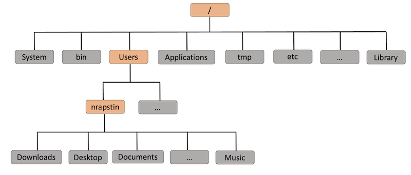

# {{ page.title }}
---

## Making and changing directories

- `ls` is the name of a built in **program** that lists the contents of the current directory
    - To run it, type `ls` in the command line and press enter:

```bash
machine_name:~$ ls
```

- The program `mkdir` accepts one **argument:** a new directory name, and creates a new directory with that name *in the current working directory:*

```bash
machine_name:~$ mkdir test_dir
```

{: .note }
A shell program's potentially multiple arguments are separated by spaces, not specified as a comma-separated list enclosed by parentheses.

- To change your current working directory, pass the name of a new directory to the program `cd` as an argument:

```bash
machine_name:~$ cd test_dir
```

- After running the command above, the new command line prompt should list `~/test_dir` as the new working directory:

```bash
machine_name:~/test_dir$
```

## File system paths

- The working directory `~/test_dir` above is an example of a file system **path**, a string that maps to a particular location on the file system.
    - Paths are strings of directory names separated by `/`

- Try making another directory inside `~/test_dir` called `test2`, confirm you created the new directory inside `test_dir` with `ls`, and then change directories to `~/test_dir/test2`:

```bash
machine_name:~/test_dir$ mkdir test2
machine_name:~/test_dir$ ls
machine_name:~/test_dir$ cd test2
```

- After running the last command above, your command line prompt should now look like so:

```bash
machine_name:~/test_dir/test2$
```

{: .note }
If we don't put `~` or `/` at the beginning of the path to the new directory that we pass to `cd`, the `cd` program looks for the new directory *relative to the current working directory.*

### Aside: escaping characters

- Suppose instead we had run the following commands:

```bash
machine_name:~/test_dir$ mkdir test 2
machine_name:~/test_dir$ ls
```

- We'd see that there are two directories named `test` and `2`!
    - Remember, arguments are separated by spaces in shell programming, so `mkdir` makes as many directories as there are arguments.

- To make a directory called `test 2` (DON'T!), you have to *escape* special characters by prefacing them with a `\` or by enclosing the whole argument in single (`'`) or double (`"`) quotes:

```bash
machine_name:~/test_dir$ mkdir test\ 2
machine_name:~/test_dir$ mkdir 'test 2'
machine_name:~/test_dir$ mkdir "test 2"
```

- *Escaping* characters means telling the shell to interpret that character literally, rather than as something with programmatic meaning.

## Relative vs. absolute file system paths

- Actually `~` is a special file system shortcut or alias for another path; use `pwd` to see full current working directory:

```bash
machine_name:~/test_dir/test2$ pwd
```

{: .note }
The output of `pwd` is a path that starts with a `/`, so it’s an **absolute path**.

- The path `/` points to the `top` of the file system, i.e. the directory that contains all others (called the "root").
 - `/` is not the "home" directory for a user because files related to the operating system live in `/` that users shouldn’t (usually) touch.

- Paths that don’t start with `/` are **relative paths**; wherever they’re used (directly in the shell or in code), they start from the current working directory, not `/`.
    - The shell assumes paths that don’t start with `/` are meant to be relative to the current working directory.

- The following file system diagram illustrates an example directory structure as a tree:



- The directories highlighted in orange form the absolute path `/Users/nrapstin`, which is aliased by `~` for my machine (my "home directory").

## Relative path helpers

- If you use the special directory name `..` somewhere in the path, it will replace the path up to the `..` with the "parent" directory of the directory before the `..`
    - E.g. the path `/this/is/a/path/..` is equivalent to the path `/this/is/a`

- You can also use `ls` to list the contents of any directory (not just the current one) by passing it a path as an argument; try passing it the path `..`:

```bash
machine_name:~/test_dir/test2$ ls ..
```

{: .note }
Since `..` doesn’t start with `/`, the shell assumes the path is relative to the current directory, so the output should be the contents of `~/test_dir` (i.e. the directory `test2`)
